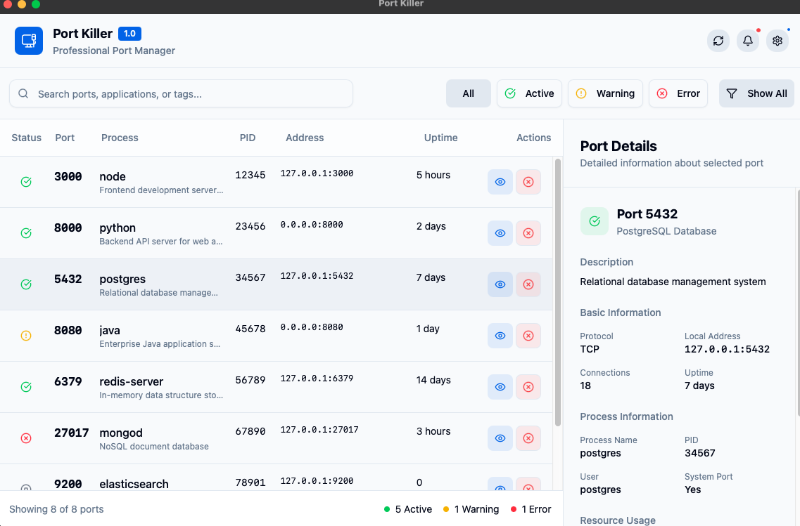
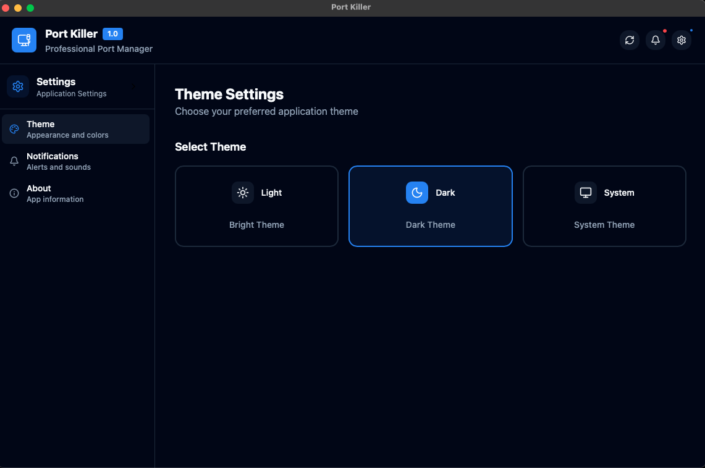

# 🚀 Port Killer — Cross-Platform Port & Process Manager

Port Killer is a fast, modern, cross-platform desktop application for managing running ports and processes on your system. It helps developers instantly identify what is running on each port (React, Django, Node, Docker, databases, etc.), inspect process details, and safely terminate unwanted services.

Built with Tauri + React + TypeScript + Rust, Port Killer is lightweight, secure, and native-feeling on macOS, Windows, and Linux.

This project was inspired by the **Port Killer** project from the **productdevbook** GitHub repository. his work motivated me to build a modern, cross-platform desktop port manager with a better UI and native desktop experience.




## ✨ Features

### 🔍 **Port Discovery & Monitoring**

- **Real-time Port Scanning**: Automatically detects all open ports on your system
- **Process Identification**: Shows which application is running on each port
- **Detailed Process Info**: PID, memory usage, CPU usage, uptime, and more
- **Smart Filtering**: Filter by status (active, warning, error), port number, or process name

### 🛠️ **Process Management**

- **One-Click Termination**: Safely kill processes running on unwanted ports
- **Process Monitoring**: Watch processes in real-time with detailed insights
- **Resource Usage**: Monitor CPU and memory consumption for each process
- **Connection Tracking**: View active connections for each port

### 🎨 **Modern UI & UX**

- **Dark/Light Themes**: Full theme support with system theme detection
- **Clean Dashboard**: 70/30 split layout for optimal information display
- **Responsive Design**: Works perfectly on all screen sizes
- **Keyboard Shortcuts**: Quick actions for power users

### 🔒 **Security & Safety**

- **System Port Protection**: Special handling for critical system ports
- **Safety Checks**: Prevents accidental termination of important processes
- **Permission Awareness**: Respects system permissions and user privileges

## 🖥️ More Info

### Dashboard View

The main dashboard shows all running ports with a clean 70/30 split layout. The left panel displays the port list with status indicators, process names, PIDs, addresses, and uptime. The right panel shows detailed information about the selected port.

### Theme Settings

Port Killer supports both light and dark themes with automatic system theme detection. The theme settings interface allows users to choose between light, dark, or system theme modes.

## 🚀 Quick Start

### Prerequisites

- **Node.js** 18+ and **npm**/**bun**/**yarn**
- **Rust** and **Cargo** (for Tauri backend)
- **System Dependencies**:
  - **macOS**: Xcode Command Line Tools
  - **Linux**: libwebkit2gtk, other system dependencies
  - **Windows**: Visual Studio C++ Build Tools

### Installation

1. **Clone the repository**

   ```bash
   git clone https://github.com/mhbaando/port-killer.git
   cd port-killer
   ```

2. **Install dependencies**

   ```bash
   bun install  # or npm install / yarn install
   ```

3. **Run in development mode**

   ```bash
   bun run tauri dev  # or npm run tauri dev
   ```

4. **Build for production**
   ```bash
   bun run tauri build  # or npm run tauri build
   ```

## 📦 Building from Source

### Development Build

```bash
# Install dependencies
bun install

# Start development server
bun run tauri dev
```

### Production Build

```bash
# Build for current platform
bun run tauri build

# Build for specific platform
bun run tauri build --target universal-apple-darwin  # macOS Universal
bun run tauri build --target x86_64-pc-windows-msvc  # Windows 64-bit
bun run tauri build --target x86_64-unknown-linux-gnu # Linux 64-bit
```

## 🏗️ Architecture

Port Killer is built with a modern, secure architecture:

### Frontend (React + TypeScript)

- **React 19**: Latest React with concurrent features
- **TypeScript**: Type-safe development
- **Tailwind CSS**: Utility-first styling
- **shadcn/ui**: Accessible UI components
- **Lucide React**: Beautiful icons
- **React Router**: Client-side routing

### Backend (Rust + Tauri)

- **Tauri 2**: Secure, lightweight desktop framework
- **Rust**: Memory-safe, high-performance backend
- **System APIs**: Native access to port and process information
- **Theme Management**: Cross-platform theme detection

### Key Technical Features

- **Zero Bundle Bloat**: ~5MB final binary size
- **Memory Safe**: Rust backend prevents memory issues
- **Cross-Platform**: Native performance on all major OSes
- **Offline First**: Works completely offline
- **Privacy Focused**: No telemetry, no data collection

## 🎯 Use Cases

### For Developers

- **Clean up development ports** after stopping servers
- **Identify port conflicts** when "address already in use"
- **Monitor resource usage** of development servers
- **Quickly terminate** runaway processes

### For System Administrators

- **Audit running services** on development machines
- **Monitor application health** through port status
- **Manage resource consumption** of background services
- **Security auditing** of open ports

### For DevOps Engineers

- **Local environment management** during development
- **Docker container port monitoring**
- **Microservices development** with multiple ports
- **CI/CD environment debugging**

## 📊 Port Detection

Port Killer uses system-native APIs to detect ports:

### Supported Protocols

- **HTTP/HTTPS**: Web servers (React, Vue, Angular, etc.)
- **TCP/UDP**: Database servers, message queues, custom protocols
- **WebSocket**: Real-time applications
- **Database Ports**: PostgreSQL (5432), MySQL (3306), MongoDB (27017), Redis (6379)
- **Development Ports**: Common dev server ports (3000, 8000, 8080, 9000, etc.)

### Detection Methods

1. **System Process Table**: Cross-platform process enumeration
2. **Network Socket Inspection**: Active connection monitoring
3. **Port Scanning**: Local port availability checking
4. **Service Discovery**: Common service pattern recognition

## 🛡️ Security Considerations

### Safe by Design

- **No Elevated Privileges**: Runs with user-level permissions
- **Local Only**: No network communication or data exfiltration
- **Transparent Operations**: All actions are logged and reversible where possible
- **User Confirmation**: Critical actions require explicit confirmation

### Data Privacy

- **No Telemetry**: Absolutely no data collection or analytics
- **Local Storage**: All data stays on your machine
- **Open Source**: Full transparency into code and operations

## 🤝 Contributing

We welcome contributions! Here's how to get started:

1. **Fork the repository**
2. **Create a feature branch**
   ```bash
   git checkout -b feature/amazing-feature
   ```
3. **Make your changes**

4. **Commit your changes**
   ```bash
   git commit -m 'Add amazing feature'
   ```
5. **Push to the branch**
   ```bash
   git push origin feature/amazing-feature
   ```
6. **Open a Pull Request**

### Development Guidelines

- Follow TypeScript best practices
- Write meaningful commit messages
- Update documentation as needed
- Follow the existing code style

### Getting Help

1. Check the [Issues](https://github.com/mhbaando/port-killer/issues) page
2. Search existing discussions
3. Create a new issue with detailed information

## 📄 License

Port Killer is licensed under the **MIT License** - see the [LICENSE](LICENSE) file for details.

### Third-Party Licenses

- [Tauri](https://tauri.app/) - Apache 2.0 / MIT
- [React](https://reactjs.org/) - MIT
- [Tailwind CSS](https://tailwindcss.com/) - MIT
- [shadcn/ui](https://ui.shadcn.com/) - MIT

## 🙏 Acknowledgments

- **Tauri Team** for the amazing desktop framework
- **React Team** for the revolutionary UI library
- **Tailwind CSS** for the incredible styling system
- **All Contributors** who help make Port Killer better

**Made with ❤️ for developers everywhere**

If you find Port Killer useful, please consider:

- Giving it a ⭐ on GitHub
- Sharing it with your colleagues
- Contributing to its development
- Reporting any issues you encounter

Happy port managing! 🚀
